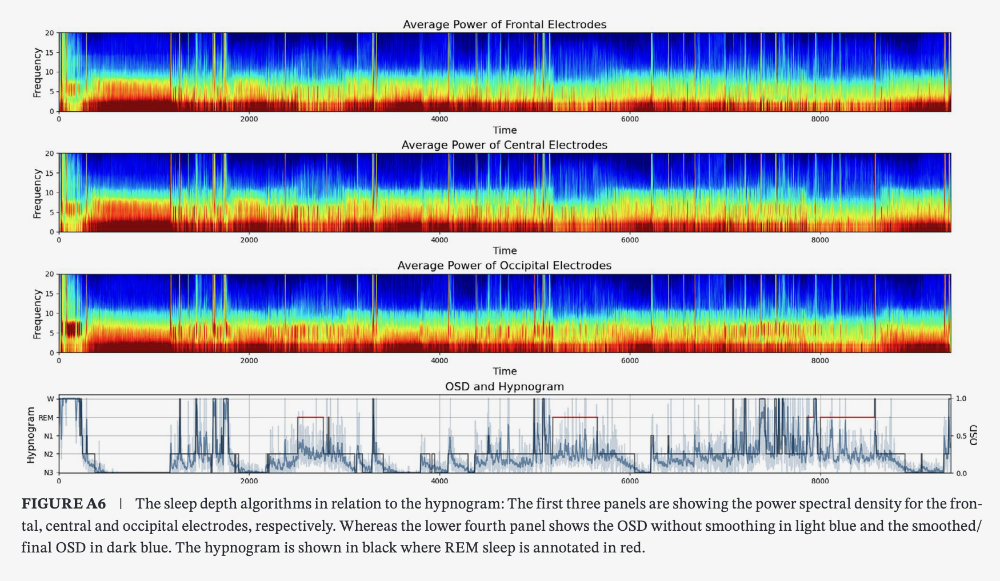

# Ordinal Sleep Depth

Ordinal Sleep Depth (OSD) scores sleep depth from EEG as a continuous signal.

This repository is organized for one primary use case:
- run the pretrained model on a new `.h5` or `.edf`  files

Everything related to training, paper reproduction, figures, and older development workflows has been moved to [`development/`](/home/wolfgang/repos/Ordinal-Sleep-Depth/development).

## Reference

If you use this tool in your research, please cite:

Meulenbrugge, E. J., Sun, H., Ganglberger, W., Nasiri, S., Thomas, R. J., & Westover, M. B. (2026). *Ordinal Sleep Depth: A data-driven continuous measurement of sleep depth*. *Journal of Sleep Research, 35*(1), e70074.



## Quick start

Run the packaged demo:

```bash
python -m OSD.demo
```

That uses [`sample-file.h5`](/home/wolfgang/repos/Ordinal-Sleep-Depth/sample-file.h5), writes `sample-file.osd.csv`, and creates `sample-file.summary.png` with:
- stage hypnogram
- EEG spectrogram
- OSD trace

## Run on your own file

```bash
python OSD/inference.py /path/to/file.h5 --plot --print-summary
```

Programmatic use:

```python
from OSD import OSDScorer

result = OSDScorer().score_h5("sample-file.h5")
osd = result.sample_scores
```

## Input

Expected input is a prepared `.h5` file with this layout:

```text
/signals/<channel_name>
/annotations/stage            # optional for inference, used in plots
/annotations/arousal          # optional
attrs['sampling_rate'] = 200
attrs['unit_voltage'] = 'V'
```

Best results use the six EEG channels:
- `f3-m2`
- `f4-m1`
- `c3-m2`
- `c4-m1`
- `o1-m2`
- `o2-m1`

The packaged sample file contains `c3-m2` and `c4-m1`. For convenience, the inference code can fill missing frontal and occipital inputs from the available left/right central channels so new users can run the demo immediately.

Optional EDF support is also available through the same interface.

## Output

The main output is a sample-level OSD array with the same length as the input EEG.

With `--plot`, the tool also writes a summary PNG with:
- stage hypnogram
- EEG spectrogram
- OSD trace

## Repository layout

- [`OSD/`](/home/wolfgang/repos/Ordinal-Sleep-Depth/OSD) is the user-facing inference package.
- [`sample-file.h5`](/home/wolfgang/repos/Ordinal-Sleep-Depth/sample-file.h5) is the built-in demo input.
- [`development/`](/home/wolfgang/repos/Ordinal-Sleep-Depth/development) contains legacy training, statistics, figure-generation, and paper-reproduction scripts.
